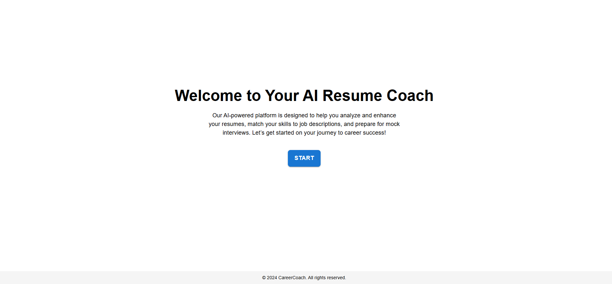
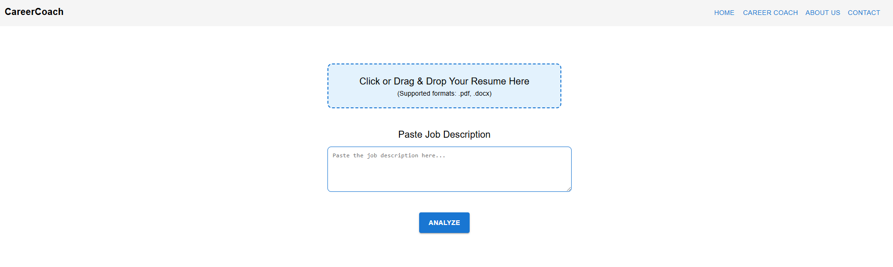
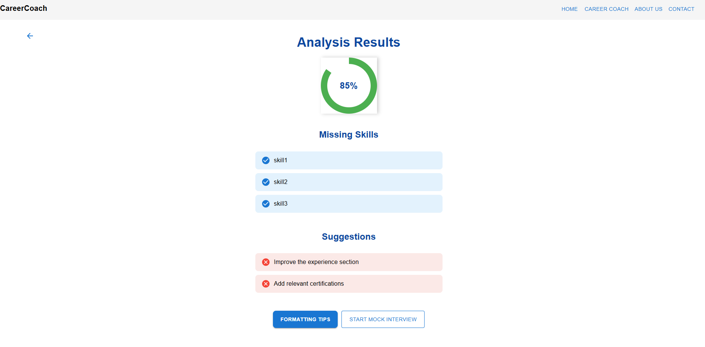

# AI-Powered Career Coach

## Overview

This AI-Powered Career Coach is designed to analyze resumes and job descriptions to provide insightful feedback, helping job seekers improve their resumes and interview preparation. The system uses OpenAI's capabilities to extract key details, compare skills, and generate recommendations.

## Features

When you upload a resume and a job description, the system provides the following insights:

1. **Missing Skills**: Compares the skills mentioned in the job description with those in the resume and lists any skills or requirements missing from the resume.
2. **Suggestions**: Provides actionable suggestions to improve the resume to better align with the job description.
3. **Formatting Tips**:
   - **Do's**: Lists positive practices that improve the resume's readability and professional appearance.
   - **Don'ts**: Highlights common mistakes or formatting issues that should be avoided.
4. **Skill Match Percentage**: Calculates a percentage value representing how well the resume matches the job description based on skills and qualifications.
5. **Mock Interview Questions**: Generates three relevant mock interview questions based on the job description.

## How It Works

### Input:

- **Resume File**: A PDF version of the resume.
- **Job Description**: The text of the job post.

### Output:

The system returns a structured JSON response containing:

```json
{
  "missingSkills": ["skill1", "skill2", "skill3"],
  "suggestions": ["Improve the experience section", "Add relevant certifications"],
  "formattingTips": {
    "do": ["Use bullet points", "Keep it concise"],
    "dont": ["Avoid large blocks of text", "Do not use unprofessional fonts"]
  },
  "skillMatch": "85%",
  "mockInterviewQuestions": [
    "Tell us about a time you used skill1 in a project.",
    "How do you handle skill2-related challenges in a team?",
    "What is your experience with skill3?"
  ]
}
```

## Technical Details

This project consists of two main directories:

### Backend (Flask & Python)

- Developed with **Flask** and **Python**.
- Uses **OpenAI API** to analyze resume and job descriptions.
- Handles file uploads and extracts text from PDFs.
- Implements **CORS** to allow frontend integration.

### Frontend (React)

- Built using **React.js** with **Bootstrap/Tailwind CSS** for a user-friendly interface.
- Allows users to upload resumes and job descriptions via a web interface.
- Displays results in an easy-to-read format with sections for **missing skills, suggestions, formatting tips, skill match percentage, and mock interview questions**.
- Implements **state management using React hooks**.
- Calls backend APIs via **fetch or Axios** to send resumes and job descriptions.
- Enhances user experience with **loading indicators, success messages, and error handling**.

### Deployment

- **Backend**: Can be hosted on **AWS EC2, Heroku, or Digital Ocean**.
- **Frontend**: Can be deployed using **Netlify, Vercel, or GitHub Pages**.
- Uses **Docker** for containerization and easy deployment.

## Setup and Installation

### Prerequisites

- Python 3.7+
- Flask
- React.js
- Node.js & npm
- OpenAI API Key
- PyPDF2 (for PDF text extraction)

### Steps to Run

#### Backend Setup

1. Clone the repository:
   ```sh
   git clone https://github.com/your-repo/ai-career-coach.git
   cd ai-career-coach/backend
   ```
2. Install backend dependencies:
   ```sh
   pip install -r requirements.txt
   ```
3. Set up OpenAI API Key:
   ```sh
   export OPENAI_API_KEY="your-api-key-here"
   ```
4. Run the Flask server:
   ```sh
   python techSkillEndpoint.py
   ```
5. The server runs on `http://127.0.0.1:5000/`

#### Frontend Setup

1. Navigate to the frontend directory:
   ```sh
   cd ../frontend
   ```
2. Install frontend dependencies:
   ```sh
   npm install
   ```
3. Start the React development server:
   ```sh
   npm start
   ```
4. The frontend runs on `http://localhost:3000/`

## Screenshots

The following images showcase different parts of the application:

**Home Page**: 
**Resume Upload Page**:
**Analysis Results Page**: 

## API Endpoint

**POST /analyze**

- **Request:**
  - `file`: PDF resume (multipart/form-data)
  - `job_post`: Job description (text)
- **Response:** JSON object with resume insights (as shown above).

## Future Enhancements

- Add **database support** to save resume analysis history.
- Support **multiple file formats** beyond PDF.
- Implement **more advanced NLP techniques** for deeper job match analysis.
- Integrate **OAuth login (Google/LinkedIn)** for a more personalized experience.
